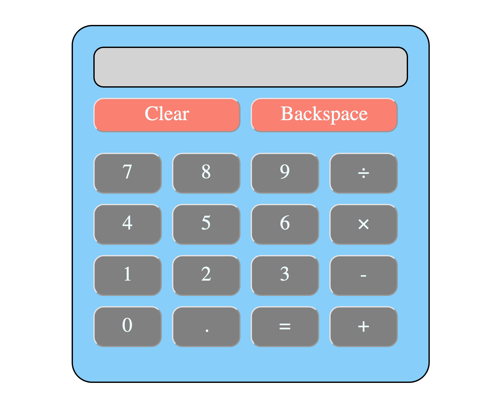

# odin-calculator

This project was completed as part of The Odin Project, however, I decided to add additional features to personalize my project and to gain more experience.

## Overview

### The challenge

Users should be able to:

- Utilize the calculator for basic arithmetic
- Calculator should automatically round to a set number of decimal places (3 decimal places chosen currently)
- Utilize a clear and backspace button to clear the screen or delete characters

### Screenshot

### Links

- Live Site URL: [Calculator - live link]()

### Built with

- Semantic HTML5 markup
- CSS custom properties
- Flexbox
- JavaScript
- JavaScript DOM